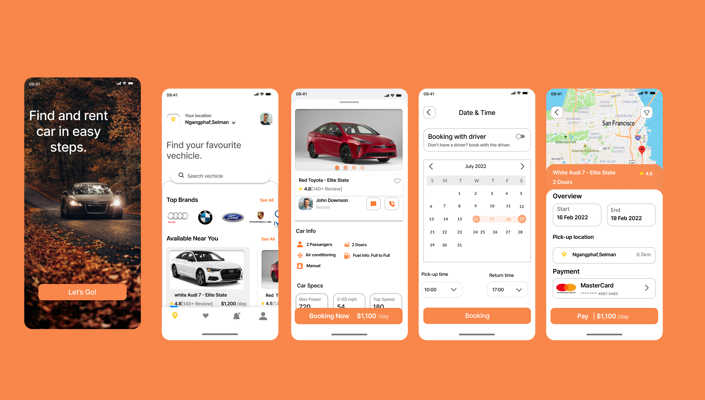

<p align="center"> 
:construction: Projeto em construção :construction:
</p>

# :iphone: Rentalcar

<div align="center">
    
</div>

---

## :bookmark_tabs: Sobre

- O Rental App, é um projeto pessoal onde seu layout foi encontrado no Figma e foi desenvolvido para aplicar e aprender mais sobre o React Native. Durante o seu desenvolvimento, foi possível entender o funcionamento de um UI Kit, Navegação, Calendários, Mapas, CMS e gerenciamento de estado.

---

## :art: Layout

- [Figma](https://www.figma.com/community/file/1128387041221027534)

---

## :gear: Techs

- [React Native](https://reactnative.dev/)
- [Expo](https://expo.dev/)
- [Native Base](https://nativebase.io/)
- [Sanity CMS](https://www.sanity.io/)
- [React Redux](https://react-redux.js.org/)
- [React Hook Form](https://react-hook-form.com/)
- [Lottie](https://lottiefiles.com/)
- [React Native Calendar](https://github.com/wix/react-native-calendars)
- [React Native Modalize](https://github.com/jeremybarbet/react-native-modalize)
- [Typescript](https://www.typescriptlang.org/)

---

## :bulb: Features adicionais

- Área dos carros alugados
- Métodos de pagamento: Cartão de crédito e dinheiro
- Animações com Lottie
- Gerenciamento de conteúdo com CMS

---

## :desktop_computer: Como usar

<p><strong>1º</strong> Criar um projeto no <a href="https://www.sanity.io/">Sanity CMS</a>
</p>

<p><strong>2º</strong> Colocar suas credenciais em um arquivo .env, tomando o arquivo .env.example como exemplo.</p>

<p><strong>3º</strong> Criar um projeto Android e um IOS no Firebase e baixar os arquivos do projeto no Firebase, tanto do Android quanto do IOS e adicionar a pasta raiz do projeto, como sugerido pela documentação do  <a href="https://rnfirebase.io/#2-android-setup">React Native Firebase</a></p>

Nome dos arquivos:

- google-services.json e GoogleService-info.plist

<br />

<p> Instalação das dependências: </p>

```
    yarn install
```

Para rodar o aplicativo é necessário a utilização do [Emulador](https://developer.android.com/studio), por isso o passo abaixo necessita que ele esteja aberto e que o [Expo-CLI](https://docs.expo.dev/workflow/expo-cli/) esteja instalado na sua máquina. Após tudo isso executar o comando abaixo:

```
    expo run:android
```

Esse comando roda o aplicativo no seu emulador Android, ou:

```
    expo run:ios
```

para rodar no emulador do IOS

<p><strong> Obs:</strong> Para o bom funcionamento do projeto é altamente recomendado a criação do projeto no Sanity CMS e do projeto no Firebase.</p>

---

## :books: License

Arquivos sob a licença [MIT](https://github.com/lucasgomesgp) criado por Lucas Gomes.
